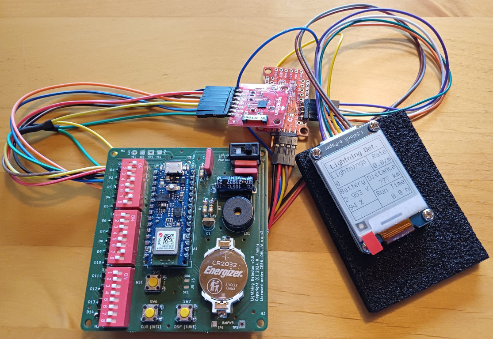
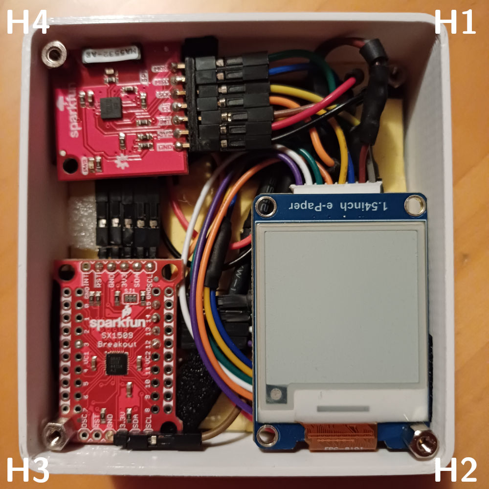
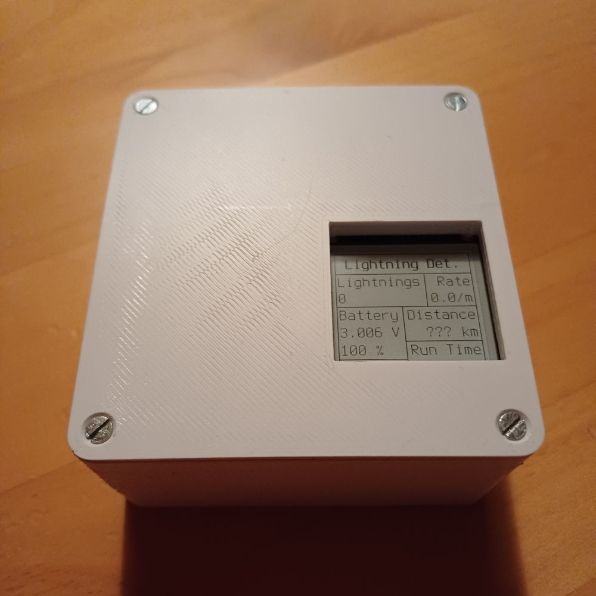
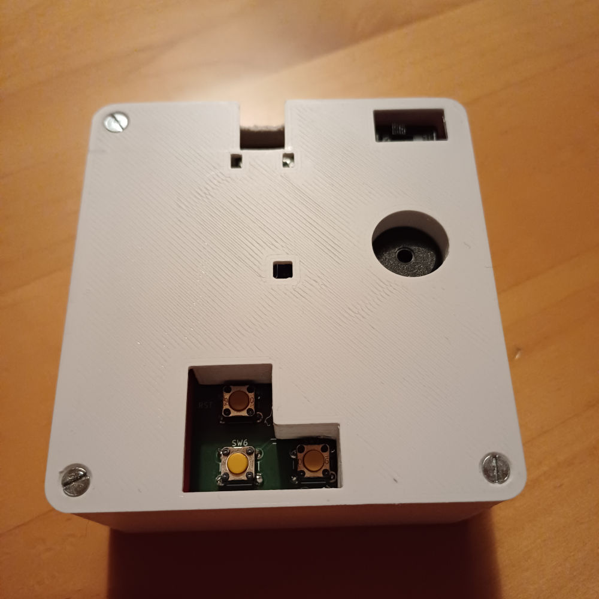

# Lightning Detector

Lightning Detector is an experimental open hardware project for early notification about approaching thunderstorm activity.
It is a battery-powered (1x or 2x `CR2032`) device with low power consumption in mind and is based on an Arduino Nano 33 BLE
as microcontroller unit (MCU) and the `AS3935` "Franklin Lightning Sensor" chip by AMS/ScioSense as main detector element.  

For license information please see the [License Information](#user-content-license-information) section at the bottom.  

**! ! ! ! ! WARNING ! ! ! ! !**  
  
**Do _NOT_ actually use Lightning Detector as a serious device to warn you about lightnings or thunderstorms!**  
It might be that lightnings will **NOT** be detected and that you will **NOT** be notified about present or
approaching thunderstorms. You have to assume that the device is inherently **UNSAFE** and does **NOT**
work properly. There is **NO** guarantee for the fitness for any particular purpose whatsoever.  
**UNDER NO CIRCUMSTANCES** should you trust the information provided (or not provided) by the device.
Lightning Detector might **NOT** be tested thoroughly enough and is **NOT** even *intended* to be a reliable detector device.  
Note that being in a thunderstorm (especially without sufficient protection around you (such as a building))
is a very dangerous situation as you might suddenly be struck by lightning, which is potentially **LIFE-THREATENING**.
Generally, you should always try to combine multiple sources of information to assess the current risk of thunderstorms
and lightning strikes. Check the weather forecast and watch the sky. Dark clouds can be an early indicator.
If in doubt (or when there is/are audible thunder or visible lightnings at the latest), please seek shelter!  
  
**! ! ! ! ! WARNING ! ! ! ! !**  
  
See also below *DISCLAIMER AND LIABILITY* [*- OHL-W*](#user-content-disclaimer-and-liability---ohl-w) and
[*- GPL*](#user-content-disclaimer-and-liability---gpl) and [*- OFL*](#user-content-disclaimer-and-liability---ofl)!  
  
The `AS3935` detects lightning strikes indirectly by means of their accompanying electromagnetic radiation,
which is claimed to work up to a maximum distance of 40 kilometers according to its datasheet. For every
lightning that is detected by the `AS3935` the Lightning Detector is going to generate an acoustic notification
(buzzer beep). Additionally, information such as accumulated lightning count and estimated "thunderstorm distance"
etcetera may be shown on a connected display. You may also establish a serial connection via the Arduino USB
connector to read debug information such as detailed data for every lightning and battery voltage etcetera.
A number of internal settings of the `AS3935` can be configured/tweaked via DIP switches in order
to individually optimize detection efficiency and false positive rejection. For a more detailed
overview about the usable features of Lightning Detector please refer to the below sections
[Configuration / Modification](#user-content-configuration--modification) and [Usage](#user-content-usage).  

This project consists of two main components:

1. Hardware design files for a printed circuit board (PCB)
2. Firmware source code for the Arduino MCU

To assemble and use the Lightning Detector the following additional *active* components are required:

## Additional Components

- Arduino Nano 33 BLE (Rev1):  
  See for instance [here](https://store.arduino.cc/products/arduino-nano-33-ble).

- SparkFun Lightning Detector AS3935 (or an equivalent unit containing an AMS/ScioSense `AS3935` chip and appropriate antenna):  
  See for instance [here](https://www.sparkfun.com/products/15441).

- Waveshare 1.54inch e-Paper Display [**optional**, display usage can be configured/disabled, see [below](#user-content-configuration--modification)]:  
  See for instance [here](https://www.waveshare.com/product/1.54inch-e-paper-module.htm).

- SparkFun 16 I/O Expander Breakout SX1509 (or an equivalent unit containing a Semtech `SX1509` chip) [**optional**, required if the above display is used]:  
  See for instance [here](https://www.sparkfun.com/products/13601).

## Hardware Assembly

You should be able to make or order a Lightning Detector PCB using the contents of the [`Hardware/`](Hardware/) directory.
In particular, there are KiCad and also Gerber files, which should enable you to do this.  

To assemble the PCB you should use the parts listed in the bill of materials (BOM) in [`Hardware/BOM/`](Hardware/BOM/).
In [`Hardware/Render_Images/`](Hardware/Render_Images/) there are render images that can be used as a reference for assembly.  

Notes about direct soldering of the Arduino:

- The Arduino is soldered directly to the PCB, unlike the other active components listed in the above
  [Additional Components](#user-content-additional-components) section, which will be later connected via the pin headers on the bottom
  side of the PCB. You could also install pin sockets in place of the Arduino footprint to be able to easily remove/replace the Arduino.
- Components `J1`, `J7` and `R3` must be installed *before* `A1` (the Arduino), unless you choose the pin socket variant mentioned above.
- For reasons of power saving (due to the small coin cell capacity) you should **cut the "3v3" jumper** `SJ4` on the Arduino board.
  This is, of course, also only possible *before* installing the Arduino to the Lightning Detector PCB, so keep this in mind!
  Again, if you choose the pin socket variant for the Arduino, this can be fixed later. Note that with the cut jumper the
  USB connector will not be able to provide power anymore, which is why you will then have to provide power over the
  Lightning Detector PCB before being able to program the Arduino or otherwise use the USB serial connection.

Further notes:

- The bottom side pin headers `J1`, `J2` and `J7` must be soldered with a slight angle with respect to the
  PCB to leave enough space for jumper cables to be connected without interfering with other components' pins.
  It is particularly helpful to limit the length of the Arduino pin ends sticking through to the
  bottom side by deliberately soldering the Arduino at an increased distance to the board.
- The two pin headers `J2` and `J7` (for `I2C`) are meant for powering and controlling the display. If you decide to use
  Lightning Detector without a display (see [Firmware Building](#user-content-firmware-building) below), they can be left out.

### Connecting Periphery

Connecting the "periphery" modules can be simply done via jumper cables.  

The SparkFun AS3935 module must be connected to pin header `J1`. Its pins map to the module pins as follows:  
(`PWR` -> `3V3`), (`SCK` -> `SCK`), (`GND` -> `GND`), (`IRQ` -> `INT`), (`MISO` -> `MISO`), (`MOSI` -> `MOSI`), (`SEL` -> `CS`)  

For reasons of power saving you should disable the power LED on the SparkFun AS3935 module by **cutting the "LED" jumper** `JP5` there.  

If the pre-defined display configuration (i.e. Waveshare 1.54inch e-Paper Display + SparkFun 16 I/O Expander Breakout SX1509)
is going to be used, you can proceed as follows:

- Pin headers `J2` and `J7` should be connected to the power and `I2C` pins of the SparkFun SX1509 module, respectively:  
  (`PWR` -> `3V3`), (`GND` -> `GND`), (`SCL` -> `SCL`), (`SDA` -> `SDA`)
- The I/O pins `#12` through `#15` of the SX1509 module are connected to the e-Paper module like this:  
  (`#12` -> `BUSY`), (`#13` -> `RST`), (`#14` -> `DC`), (`#15` -> `CS`)
- Power pins of the e-Paper module (`VCC` and `GND`) may either be connected to `J2` as well
  (using split jumper cables) or simply to the spare `3V3` and `GND` pins on the SX1509 module.
- The e-Paper module shares the SPI bus with the AS3935 module. Hence two specific pins of `J1`
  must also be connected to the corresponding e-Paper module pins (using split jumper cables):  
  (`SCK` -> `CLK`), (`MOSI` -> `DIN`)

### Example Setup

The final assembly may look similar to this:  



#### Case

In [`Hardware/Case/`](Hardware/Case/) there are CAD files for a 3D-printable case that can be
used if all above-mentioned additional periphery modules are attached to the back of the PCB
in a particular layout using the mounting holes and appropriate spacers, as can be seen below:  

<p align="center"><table><tr>
<td width="33%"><a href="Documentation/example_setup_case_1.jpg" alt="Example setup with case (1/3)"></a></td>
<td width="33%"><a href="Documentation/example_setup_case_2.jpg" alt="Example setup with case (2/3)"></a></td>
<td width="33%"><a href="Documentation/example_setup_case_3.jpg" alt="Example setup with case (3/3)"></a></td>
</tr></table></p>

Note that in this configuration the `AS3935` is very close to the rest of the electronics,
which had caused frequent false positive lightning interrupts in my case. This was successfully
suppressed by inserting a grounded sheet of copper foil between the PCB and the attached periphery.

## Firmware Building

Building and uploading the firmware can be accomplished with the [Arduino IDE](https://www.arduino.cc/en/software)
(tested with [Arduino IDE 1.x](https://github.com/arduino/arduino), but should also work with [Arduino IDE 2.x](https://github.com/arduino/arduino-ide)):

- Open the Sketch [`Firmware/lightning_detector/lightning_detector.ino`](Firmware/lightning_detector/lightning_detector.ino)
- If required, make code adjustments to configure things like presence of a display etcetera (see [below](#user-content-configuration--modification))
- Make sure to select the correct board type ("Arduino Nano 33 BLE")
- Connect the Arduino via USB and, if `SJ4` was cut (see [Hardware Assembly](#user-content-hardware-assembly) above), power up the Lightning Detector device
- Compile the sketch and then upload it to the Arduino

Depending on your operating system, your Arduino IDE version and your preference, you might have to make sure
that you additionally have the following software components installed, prior to building the firmware:

- The [Arduino Core for `mbed` MCUs](https://github.com/arduino/ArduinoCore-mbed) (including the [Arduino Core API](https://github.com/arduino/ArduinoCore-api))
- A working [GCC](https://gcc.gnu.org/) toolchain for the `arm-none-eabi` target platform (including [Newlib](https://www.sourceware.org/newlib/))
- A patched version of [BOSSA](https://github.com/arduino/BOSSA/commit/37600d1635f830cc0cdf7c56e586a021272c4e35) from Arduino for uploading the Sketch

Those can be either installed using the Arduino IDE board manager (simply look for "Mbed OS Nano Boards" and/or "Arduino Nano 33 BLE"),
or by yourself using existing packages provided by your operating system distribution or directly from the mentioned sources.

### Configuration / Modification

Before building the firmware you may want to do some code modifications, the most important/interesting of which are listed in the following:

- **Use different SX1509 I/O pins:**  
  If desired, the specific I/O pin numbers of the `SX1509` that are used for the e-Paper module signals `BUSY`, `RST`, `DC` and `CS`
  may be changed in the file [`pins.h`](Firmware/lightning_detector/pins.h) (within the `namespace SX1509Pins`).

- **Disable display usage:**  
  If no display is going to be connected, set the `USE_DISPLAY` macro in [`usedisplay.h`](Firmware/lightning_detector/usedisplay.h) to `USE_DISPLAY_NONE`.

- **Use a different display:**  
  The display part of the firmware is somewhat modular so that it is basically possible to use a completely different display module
  by "simply" writing a dedicated driver class implementation for it, which can of course be modified from the existing display driver
  (see [`display_waveshareepaper154bw_sx1509ioexpander.h`](Firmware/lightning_detector/display_waveshareepaper154bw_sx1509ioexpander.h)
  and [`display_waveshareepaper154bw_sx1509ioexpander.cpp`](Firmware/lightning_detector/display_waveshareepaper154bw_sx1509ioexpander.cpp)).  
  Furthermore, you will need to make the following changes:
  - Add a new macro to [`usedisplay.h`](Firmware/lightning_detector/usedisplay.h) and assign it to `USE_DISPLAY` there.
  - Add the new class header to [`display.h`](Firmware/lightning_detector/display.h) using the previously added macro.
  - Add a matching display declaration in the main [`lightning_detector.ino`](Firmware/lightning_detector/lightning_detector.ino) file (search for `USE_DISPLAY`).

- **General tweaks:**  
  At the top of [`lightning_detector.ino`](Firmware/lightning_detector/lightning_detector.ino), right before the declaration of
  the *interrupt flags*, there are a bunch of constant definitions, which can be adjusted to your liking, such as, for instance:
  - `buzzerFreq`: Buzzer beep frequency
  - `buzzerLightBeepSecs`: Buzzer beep duration for lightning notification
  - `lightRateAvrgMins`: Minimum averaging time to determine current lightning rate
  - `systemMinVoltage`: Largest minimum allowed operating voltage for any system component
  - `systemMaxCurrent`: Maximum system current (e.g. during beep or display update)
  - `systemBatteryCount`: Number of installed coin cells

### Documentation

Firmware code documentation can be generated using [Doxygen](https://github.com/doxygen/doxygen)
(there is a `Doxyfile` in [`Documentation/Firmware/`](Documentation/Firmware/)).

## Usage

### Before Use

- **DIP switch settings:**  

  Make sure to set the DIP switches to the default configuration before use. From left to right (`D1` to `D14`) this is:

  ```
  Register AFE_GB NF_LEV WDTH SREJ TUN_CAP LCO_FDIV MIN_NUM_LIGH
  Value    10010  010    0010 0010 0000    00       00
  ```

  **Note 1:** The default amplifier gain setting `AFE_GB` is recommended for _indoor_ use. For _outdoor_ use they recommend `01110` instead.  
  **Note 2:** The _optimal_ "default" `TUN_CAP` setting is later determined via the antenna tuning procedure (see below).
              The above default is just an arbitrary starting point.  

  The register settings can of course be tweaked as you like. For the meaning/effect of each register please refer to the `AS3935` datasheet.  

- **Antenna tuning:**  

  The AS3935 module antenna needs to be tuned to the resonance frequency of `500 kHz +- 17.5 kHz` before use.
  This can be achieved with the antenna tuning mode (see below).

### Using The Lightning Detector

There are three different "run modes" that can be selected at startup:
- _Normal_: Normal lightning detection mode
- _UnmaskDisturbers_: Same as _Normal_ mode, except for unmasked disturber interrupts and enabled serial connection
- _TuneAntenna_: Antenna tuning mode

The default mode is the _Normal_ mode. Just power up the device to use this mode.  

The _Normal_ mode can be overridden at startup by pressing the `CLR (DIST)` button (_UnmaskDisturbers_) or the `DSP (TUNE)` button (_TuneAntenna_) when/until
the second short buzzer beep is played. There is a first short buzzer beep followed by a `500 ms` delay that enables you to press the buttons in time.

- **_Normal_:**  

  In the _Normal_ mode the main functionality is the lightning notification. Whenever the `AS3935` detects a lightning signal the
  Arduino wakes up from sleep mode (which is used most of the time) via interrupt request and then there is going to be a buzzer
  beep and a short _red_ blip of the RGB LED on the Arduino board. After that the Arduino goes to sleep mode again to save power.  

  Other wake-up reasons (i.e. available functionality) are one of the two push buttons (`CLR (DIST)` or `DSP (TUNE)`) being pressed,
  other `AS3935` IRQ events and a recurring timer timeout (see explanations below). All of the `AS3935` interrupts produce a
  _red_ RGB LED blip, pressed buttons produce a _green_ RGB LED blip and the timer wake-up produces a _blue_ RGB LED blip.  

  Using the lightning interrupts the total number of lightnings is counted and an average lightning rate is calculated.
  Also the estimated storm distance is read for every lightning interrupt and for the dedicated "distance changed" interrupts
  (purely age-based statistics evolution). All of this information (and more) can be displayed on the display on request
  (see below), including, which was the last `AS3935` interrupt. Note, in that regard, that there is also an interrupt
  for too much antenna/amplifier noise. This does not have any direct effect other than the LED blips but can thus
  of course be checked for on the display. Note that the _disturber_ signal interrupts are disabled in this mode.  

  The timer wake-up is used (a) to periodically monitor the battery voltage and (b) to avoid being locked when an `AS3935`
  interrupt is raised while going to sleep as the IRQ signal is not transient but stays high until the interrupt type
  is read. The timer itself is also used to calculate the lightning rate and to accumulate the device's run time.  

  Pressing the `CLR (DIST)` button clears the `AS3935` distance estimation statistics, resets lightning counter
  and lightning rate as well as the latest interrupt type and the latest read lightning "energy" value.  

  Pressing the `DSP (TUNE)` button updates the display. The displayed information is (~ from top-left to bottom-right):
    1. Lightning count
    2. Current lightning rate
    3. Battery state (raw voltage and an estimated charge percentage)
    4. Estimated storm distance from `AS3935` ("???" if reported out of range)
    5. Short status information (from left to right):
        - 'D' if run mode is _UnmaskDisturbers_ (see dedicated section), just ' ' (space) else
        - 'S' if serial connection is enabled (see _UnmaskDisturbers_ mode as well), just ' ' (space) else
        - Latest interrupt type:
          - "" (nothing) for "lightning"
          - "dDst" for "distance changed"
          - "Dist" for "disturber detected" (see _UnmaskDisturbers_ mode)
          - "NOIS" for "too much noise"
          - "INV" for invalid interrupts
    6. Approximate device run time as hours (`xx.x h`) if below 24 hours or as days+hours (`xxxd xxh`) otherwise.

  Note that the reported battery percentage is just an estimate using a look-up table based on some discharge curve. This is already
  inaccurate, although it does take current consumption and internal battery resistance into account. However, those two quantities
  are just approximately known in advance and also the `CR2032` batteries do seem to have somewhat unpredictable, additional voltage
  fluctuations under varying load currents. Therefore please consider the percentage value just as a **very** rough estimate.
  The value seems to get more predictable/reliable, though, when the device has been continuously running for a few days.  

  Also note that the reported "storm distance" value should not necessarily be trusted. This quantity cannot really be _measured_
  using a single sensor at just one place. The value comes directly out of the `AS3935` chip and the datasheet claims that the chip
  can estimate the storm distance by means of a statistical algorithm. There is little explanation of this algorithm, so it might
  actually work but it might as well not work satisfactorily. The value is in any case shown on the display for completeness.  

  If you see the noise interrupt and cannot get rid of it via the `CLR (DIST)` button, refer to the `AS3935` datasheet for how to change the
  register settings to mitigate the noise issue. Note that the configuration is only read from the DIP switches _once_ at startup/reset.  

  The maximum run time of the device is mostly limited by the `AS3935` current consumption. This _should_ be around `350 µA` _or_ `60 µA` for the
  "signal verification mode" _or_ the "listening mode", respectively, according to the datasheet. The sensor should automatically switch to the
  power saving "listening mode" when there is no significant antenna activity, but so far I _could not confirm this by measurements_. Note that
  I made the measurements in a populated area (i.e. picked up noise from surrounding electronics etcetera) and that it might eventually switch
  to "listening mode" when in the back country (which I did _not_ test, though). Adding the much smaller Arduino sleep current (and accounting
  for a higher current during the occasional wake-ups), this means that the Lightning Detector should be able to run for either _almost 6 weeks_
  ("signal verification mode") or _up to 5 months_ ("listening mode") when using two good, parallel `CR2032` batteries (not tested yet either).
  Note, of course, that the achievable run time will be much smaller if you mostly or only use the device during known thunderstorms.  

  The operating voltage is measured approximately every 30 minutes (or every 10 minutes when there is high lightning activity, due to the increased
  current consumption). This only happens when the Arduino wakes up anyway because of one of the mentioned interrupts. If the voltage dropped below
  the point where the minimum operating voltage could not be sustained under the maximum expected current consumption (i.e. below around `2.51 V`),
  then the display is automatically updated one last time and both the buzzer beep and updating the display get disabled to save power. This is also
  acoustically notified using a few seconds long beep sequence (12 beeps). The battery percentage on the display should now read (approximately)
  `0 %`. What remains for the lightning notification are the mentioned RGB LED blips (and serial debug messages for _UnmaskDisturbers_ mode,
  see section below). When the voltage finally drops below the minimum voltage for the `AS3935` chip (`2.4 V`), then the device becomes useless.
  As it cannot switch itself off, it now enters an infinite "sleep loop". This basically disables all functionality, except that now, whenever the
  previously mentioned wake-up timer times out, there will be a 5x blink sequence of the _blue_ RGB LED to remember to switch the device off.

- **_UnmaskDisturbers_:**  

  This mode basically works the same as the _Normal_ mode. The difference is that the `AS3935` now also generates interrupts
  for signals recognized as "disturbers" and that the serial connection will be enabled if a connection is attempted at startup.  

  The disturber interrupts do _not_ generate beeps but can still be recognized by the _red_ RGB LED blips.
  Furthermore it can now be seen on the display if the last `AS3935` interrupt was caused by a disturber.
  If the serial connection is active (see also below), the disturber event is also printed to the serial console.  

  After the second short buzzer beep at startup, if _UnmaskDisturbers_ mode was selected, there is a delay of 5 seconds during which you can attempt
  to connect to the Arduino via a serial console (`9600 Baud`). If this is successful, this will be be used in the following to output a number
  of debug messages, such as `AS3935` events, measured `VDD` voltage etcetera. Please refer to the code for all the possible messages.

- **_TuneAntenna_:**  

  This mode starts with a "buzzer response" test sequence, which can be ignored for the first procedure (see below)
  but can be helpful for the second "acoustic matching" procedure and is hence further explained there (see further below).  

  Whenever the `DSP (TUNE)` button gets pressed the current DIP switch configuration is read and applied to the `AS3935`.
  This can be used to adjust the `TUN_CAP` register setting until the resonance frequency matches the `500 kHz` (remember
  the uncertainty window of `+- 3.5%`, respectively `+- 17.5 kHz`). There are two possibilities for the tuning procedure:

  - Tuning with an oscilloscope or similar devices:  
    Set `LCO_FDIV` to `00` or an appropriate higher value given the bandwidth limit of your measurement device.
    The `00` setting yields a digital `~ 500/16 kHz = 31.25 kHz` signal at the IRQ pin of the AS3935 module,
    which can then be measured and matched using the `TUN_CAP` register. `LCO_FDIV` equal to `01` divides
    by 32, `10` divides by 64 and `11` divides by 128 (`~ 3.9 kHz`).

  - Tuning using the buzzer and acoustic frequency matching:  
    If no such measurement device is available, set `LCO_FDIV` to `11` (or `10`). This will reproduce the digital
    resonance signal of the IRQ pin on the buzzer output such that you can acoustically match the audible frequency
    to `~ 500/128 kHz` (or `~ 500/64 kHz`) using an instrument tuner or by generating a beat signal versus the target
    frequency. The sound always plays as long as the `DSP (TUNE)` button is being pressed. Note that you should
    listen to the "buzzer response" test sequence played in the beginning to assess the suitability of the used
    buzzer for the acoustic matching procedure. Depending on the buzzer model (avoid its resonance frequency)
    and the chosen frequency (`LCO_FDIV`) you might not be able to resolve different frequencies sufficiently
    well to be able to properly tune the antenna. The sequence plays 13 beeps with frequencies around the
    divided target frequency, all separated by steps of 10 cents. You should be able to resolve at least
    around 3 of those 13 frequencies. The test uses the frequency according to the `LCO_FDIV`
    setting at startup. Start with `11` and if that does not work out use `10` instead.

## Known Issues

- Sometimes the Arduino appears to take rather long to wake up from sleep mode. When you wake it up by pressing
  one of the push buttons, this _can_ result in it getting stuck due to the debouncing (recognizable by the
  _green_ RGB LED being continuously on). You just need to press the button again to resolve this.
- Apparently, as already mentioned in the [Case](#user-content-case) section, the `AS3935`
  raises false positive lightning interrupts when it gets too close to the main PCB.
  Hence you might need to add additional shielding, depending on your setup.

## License Information

Copyright (C) 2024–2025 M. Frohne  

Lightning Detector is licensed under the "*CERN Open Hardware Licence, Version 2 - Weakly Reciprocal*" or (at your option) any later version.  
(please refer to the file [`LICENSE.OHL-W`](LICENSE.OHL-W))  

This does NOT apply to the firmware code that is found in the [`Firmware/`](Firmware/) directory, which is instead
licensed under the "*GNU General Public License, Version 3*" or (at your option) any later version.  
(please refer to the file [`LICENSE.GPL`](LICENSE.GPL))  

Note also that the firmware files in the directory [`Firmware/lightning_detector/fonts/`](Firmware/lightning_detector/fonts/) embed a subset
of the Terminus Font and are hence additionally licensed under the "*SIL Open Font License, Version 1.1*", with Reserved Font Name "Terminus Font".  
(please refer to the file [`LICENSE.OFL`](LICENSE.OFL))

### DISCLAIMER AND LIABILITY - OHL-W

- DISCLAIMER OF WARRANTY -- The Covered Source and any Products
  are provided 'as is' and any express or implied warranties,
  including, but not limited to, implied warranties of
  merchantability, of satisfactory quality, non-infringement of
  third party rights, and fitness for a particular purpose or use
  are disclaimed in respect of any Source or Product to the
  maximum extent permitted by law. The Licensor makes no
  representation that any Source or Product does not or will not
  infringe any patent, copyright, trade secret or other
  proprietary right. The entire risk as to the use, quality, and
  performance of any Source or Product shall be with You and not
  the Licensor. This disclaimer of warranty is an essential part
  of this Licence and a condition for the grant of any rights
  granted under this Licence.

- EXCLUSION AND LIMITATION OF LIABILITY -- The Licensor shall, to
  the maximum extent permitted by law, have no liability for
  direct, indirect, special, incidental, consequential, exemplary,
  punitive or other damages of any character including, without
  limitation, procurement of substitute goods or services, loss of
  use, data or profits, or business interruption, however caused
  and on any theory of contract, warranty, tort (including
  negligence), product liability or otherwise, arising in any way
  in relation to the Covered Source, modified Covered Source
  and/or the Making or Conveyance of a Product, even if advised of
  the possibility of such damages, and You shall hold the
  Licensor(s) free and harmless from any liability, costs,
  damages, fees and expenses, including claims by third parties,
  in relation to such use.

See the CERN Open Hardware Licence for more details. 

### DISCLAIMER AND LIABILITY - GPL

Lightning Detector's firmware is distributed in the hope that it
will be useful, but WITHOUT ANY WARRANTY; without even the implied
warranty of MERCHANTABILITY or FITNESS FOR A PARTICULAR PURPOSE.  

See the GNU General Public License for more details.

### DISCLAIMER AND LIABILITY - OFL

THE FONT SOFTWARE IS PROVIDED "AS IS", WITHOUT WARRANTY OF ANY KIND,
EXPRESS OR IMPLIED, INCLUDING BUT NOT LIMITED TO ANY WARRANTIES OF
MERCHANTABILITY, FITNESS FOR A PARTICULAR PURPOSE AND NONINFRINGEMENT
OF COPYRIGHT, PATENT, TRADEMARK, OR OTHER RIGHT. IN NO EVENT SHALL THE
COPYRIGHT HOLDER BE LIABLE FOR ANY CLAIM, DAMAGES OR OTHER LIABILITY,
INCLUDING ANY GENERAL, SPECIAL, INDIRECT, INCIDENTAL, OR CONSEQUENTIAL
DAMAGES, WHETHER IN AN ACTION OF CONTRACT, TORT OR OTHERWISE, ARISING
FROM, OUT OF THE USE OR INABILITY TO USE THE FONT SOFTWARE OR FROM
OTHER DEALINGS IN THE FONT SOFTWARE.  

See the SIL Open Font License for more details.
